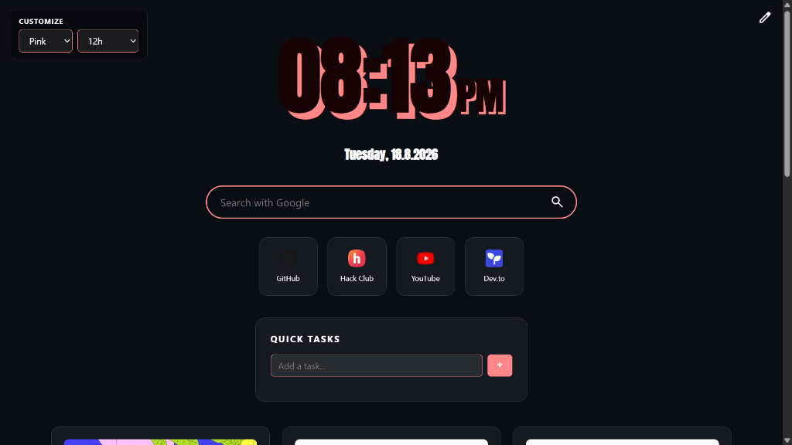

# NewTab 3.0 🚀

heyy! welcome to my custom new tab page project i built for Hack Club Stardance (the Give Your Website a Pulse mission)!



👉 **[Try the Live Demo here!](https://evinjsubin.github.io/NewTab-3.0/)**

---

## 🌟 why i made this

i really hated opening my browser and seeing the super boring blank white default chrome new tab page every time. i wanted something retro and cool with a big 3D block shadow clock, shortcuts to my fav sites, a quick task list, and live tech news feeds!

so i decided to build my own from scratch using plain html, css, and js!

---

## ✨ cool features

- **retro 3d block clock**: giant 3D block shadow clock! you can switch between 24h, 12h (with cute small am/pm), seconds, or minimal mode.
- **custom google fonts**: applies cool google fonts (like DynaPuff, Inter, Pacifico, Orbitron, Anton, etc) specifically to the clock & date so the rest of the site stays clean!
- **multi search bar**: quickly search using DuckDuckGo, Google, Ecosia, or Brave.
- **square shortcut tiles**: minimal square cards for your main websites with auto loading favicons.
- **quick task list**: write down quick todo notes (saves directly in your browser storage so it doesnt disappear when you refresh!).
- **live daily feed**: automatically fetches real daily tech & dev articles from the Dev.to public API!
- **theme & color customiser**: switch between dark/light mode presets, pick from 6 color themes (cyan, blue, green, purple, pink, red), or set your own background image URL.
- **config page**: click the top right edit icon to open `config.html` and change all your settings!

---

## 💻 how to run it locally

you dont need to install npm, node, or any weird build tools! just clone it and double click `index.html`:

```bash
# 1. clone the repository
git clone https://github.com/EVINJSUBIN/NewTab-3.0.git

# 2. open the folder
cd NewTab-3.0

# 3. open index.html in your browser!
```

---

## 🛠️ how i built it

i wanted to keep it super simple and lightweight, so i used zero frameworks or external libraries:

- `index.html` - main new tab dashboard page
- `config.html` - settings configuration page
- `style/style.css` - dashboard styling & theme variables
- `style/config.css` - config page layout & form styling
- `script/main.js` - clock, search bar, shortcut tiles, quick tasks, & Dev.to API feed
- `script/config.js` - config page settings form bindings & custom shortcut manager

---

## 🙏 credits & thanks

- built for [Hack Club Stardance](https://stardance.hackclub.com/missions/nasa-page) (Give Your Website a Pulse mission)
- DynaPuff font by Toshi Omagari
- Google Fonts API & Dev.to Public API
- made with ❤️ by Evin J Subin

MIT License © 2026 Evin J Subin
